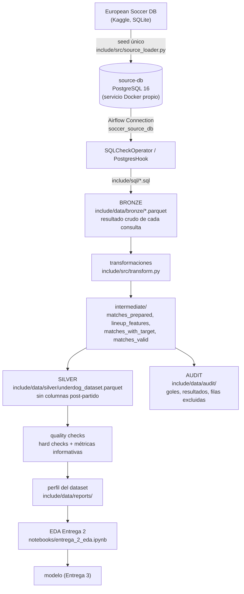
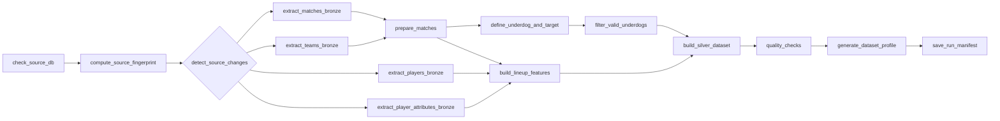

# Arquitectura

La fuente es una base de datos. Airflow la consulta a través de una Connection. El resultado de cada
consulta se guarda como capa **Bronze**, y a partir de Bronze se construye **Silver**.

## Dos bases de datos distintas

| Servicio | Qué es | Quién lo crea |
|---|---|---|
| `postgres` | Metadata interna de Airflow (DAG runs, estados, XCom). **No** tiene datos del proyecto. | Astro (`astro dev start`) |
| `source-db` | La **base fuente** del proyecto: las 7 tablas de la European Soccer Database. | `docker-compose.override.yml` + seed |

`source-db` simula una base real levantada de forma independiente. Tiene su propio volumen (`source_db_data`),
sus propias credenciales (`source_db.env`, fuera de git) y se expone en `localhost:5433` para inspeccionarla desde la PC.
Dentro de la red de Docker, Airflow la ve como `source-db:5432`.

### Por qué un seed y no descargar en cada corrida

La European Soccer Database se publica como SQLite. `python -m include.src.source_loader` la copia **una sola vez** a
PostgreSQL:
- tablas y columnas en minúscula;
- tipos según el contenido real de cada columna;
- `date` y `birthday` como `TIMESTAMP`;
- se mantienen la PK y los UNIQUE, y se agregan índices para las consultas del pipeline.

El seed es idempotente: si una tabla ya tiene la cantidad de filas del SQLite, la saltea. Se verificó que los agregados
de control (goles, cuotas, ratings, alturas, nulos) dan exactamente igual en PostgreSQL que en el SQLite original.
Después del seed el DAG **nunca** lee el SQLite ni descarga nada de Kaggle.

Alternativa evaluada: `pgloader` en un contenedor aparte. Se descartó porque suma otra imagen y porque su conversión de tipos
de SQLite no es controlable desde el proyecto. El seed en Python usa la misma Airflow Connection que el DAG, así que
tampoco conoce credenciales.

## Tasks del DAG `underdog_pipeline` (15)

| Task | Qué hace | Entra | Sale |
|---|---|---|---|
| `check_source_db` | `SQLCheckOperator`: la base responde por la Connection y sus 5 tablas tienen filas. Si falta el seed, falla acá. | `sql/check_source_db.sql` | — |
| `compute_source_fingerprint` | Huella de la fuente: filas, fecha máxima y md5 del contenido de cada tabla, más el hash del código del pipeline. | `sql/source_fingerprint.sql` | XCom: huella (dict chico) |
| `detect_source_changes` | `@task.short_circuit`: si la huella coincide con la de la última corrida exitosa y Silver existe, **saltea todo lo que sigue**. `force_rebuild=true` fuerza. | huella + `silver/_manifest.json` | True/False |
| `extract_matches_bronze` | Consulta SQL de partidos (83 columnas explícitas). | `sql/extract_matches.sql` | `bronze/matches.parquet` (25.979 filas) |
| `extract_teams_bronze` | Consulta SQL de equipos. | `sql/extract_teams.sql` | `bronze/teams.parquet` (299) |
| `extract_players_bronze` | Consulta SQL de jugadores (nacimiento y altura). | `sql/extract_players.sql` | `bronze/players.parquet` (11.060) |
| `extract_player_attributes_bronze` | Consulta SQL de snapshots de atributos (9 atributos usados). | `sql/extract_player_attributes.sql` | `bronze/player_attributes.parquet` (183.978) |
| `prepare_matches` | Filtros de inclusión, una casa de apuestas por partido, probabilidades implícitas normalizadas. | Bronze matches + teams | `intermediate/matches_prepared.parquet`, `audit/excluded_prepare_matches.parquet` |
| `build_lineup_features` | Features de los 22 titulares con el snapshot **estrictamente anterior** al partido. | prepared + Bronze players + player_attributes | `intermediate/lineup_features.parquet` |
| `define_underdog_and_target` | Favorito/underdog y `gano_no_favorito`. Único lugar donde se usan los goles. | prepared | `intermediate/matches_with_target.parquet` |
| `filter_valid_underdogs` | Saca los partidos sin underdog identificable (gap ≤ 0,05) y guarda la sensibilidad a cada umbral. | with_target | `intermediate/matches_valid.parquet`, `reports/threshold_sensitivity.csv`, `audit/excluded_filter_underdogs.parquet` |
| `build_silver_dataset` | Orienta los features a underdog − favorito y separa Silver de Auditoría. | valid + lineup_features | `silver/underdog_dataset.{parquet,csv}`, `audit/match_audit.parquet`, `audit/excluded_matches.parquet` |
| `quality_checks` | 17 hard checks (fallan la corrida, sin reintentos) + métricas informativas. | Silver | `reports/quality_report.json` |
| `generate_dataset_profile` | Perfil de la Entrega 2 y auditoría de fuga columna por columna. | Silver | `reports/dataset_profile.{json,md}`, `reports/leakage_audit.csv` |
| `save_run_manifest` | Registra la huella procesada. Recién acá una corrida cuenta como "procesada". | huella + metadata | `silver/_manifest.json` |

### Reglas de orquestación

- **XCom solo lleva metadata**: rutas, filas, columnas, sha256, embudos de conteo. Ningún DataFrame viaja por XCom:
  cada etapa persiste su resultado en Parquet y la siguiente lo lee de la ruta que recibe.
- **Idempotencia**: toda escritura es atómica (archivo temporal + `os.replace`) y reemplaza al anterior. Correr dos
  veces con la misma fuente da archivos idénticos (las consultas tienen `ORDER BY` determinístico).
- **Reintentos**: 2, cada 2 minutos, para fallas transitorias de la base. `quality_checks` no reintenta porque
  un error de datos no se arregla solo. `max_active_runs=1`, porque dos corridas no deben escribir los mismos archivos.
- **Errores**: `check_source_db` y `quality_checks` detienen el pipeline. Una corrida que falla no escribe el manifest,
  así que la siguiente vuelve a intentar.

## Schedule y detección de cambios

- `schedule="0 6 * * *"` (06:00 UTC), `catchup=False`, disparo manual disponible desde la UI con el parámetro `force_rebuild`.
- **Por qué diario**: la fuente cambia a lo sumo una vez por jornada, y hay jornadas de fin de semana y de mitad de semana.
  Una corrida diaria detecta una jornada nueva en menos de 24 h; una semanal podría tardar 6 días con una fecha de mitad de semana.
- **Por qué no se reconstruye siempre**: `detect_source_changes` compara la huella actual contra la de la última corrida
  exitosa. Si nada cambió, la corrida hace **una consulta de ~1 s** y deja las otras 12 tareas en *skipped*
  (verificado en Airflow). La huella incluye un md5 del contenido de cada tabla, así que también detecta **correcciones**
  sobre filas existentes (un gol o una cuota corregida), no solo filas nuevas. También incluye un hash del código (SQL,
  `config.py`, `include/src/`): si cambian las reglas de negocio, la próxima corrida reconstruye aunque la fuente sea la misma.

## Capas en disco

| Carpeta | Qué hay | Se versiona |
|---|---|---|
| `include/data/raw/` | `soccer_db/database.sqlite`: solo lo lee el seed | no |
| `include/data/bronze/` | una tabla Parquet por consulta SQL, sin transformar | no |
| `include/data/intermediate/` | resultados de cada etapa entre Bronze y Silver | no |
| `include/data/silver/` | `underdog_dataset.parquet` (+ copia `.csv`) y `_manifest.json` | no |
| `include/data/audit/` | goles, resultados, cuotas crudas y partidos excluidos con motivo | no |
| `include/data/reports/` | quality report, perfil, auditoría de fuga, sensibilidad del umbral | no |

Parquet porque conserva tipos (enteros con nulos, timestamps), comprime y es lo que lee pandas sin configuración.
`pyarrow` ya era la dependencia natural.
